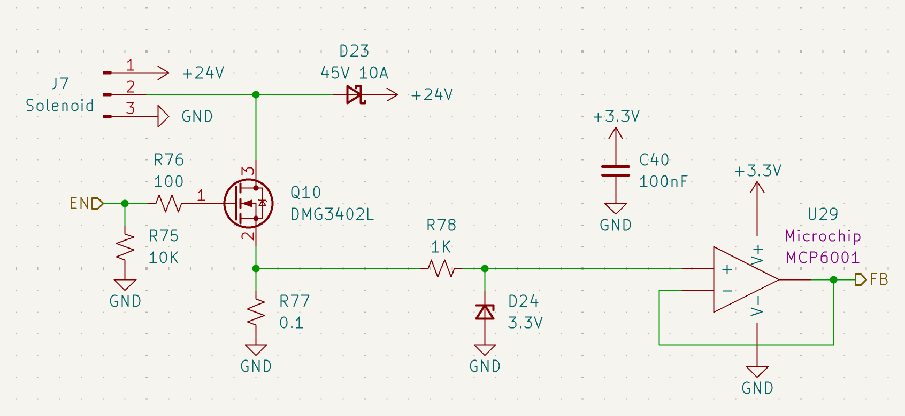
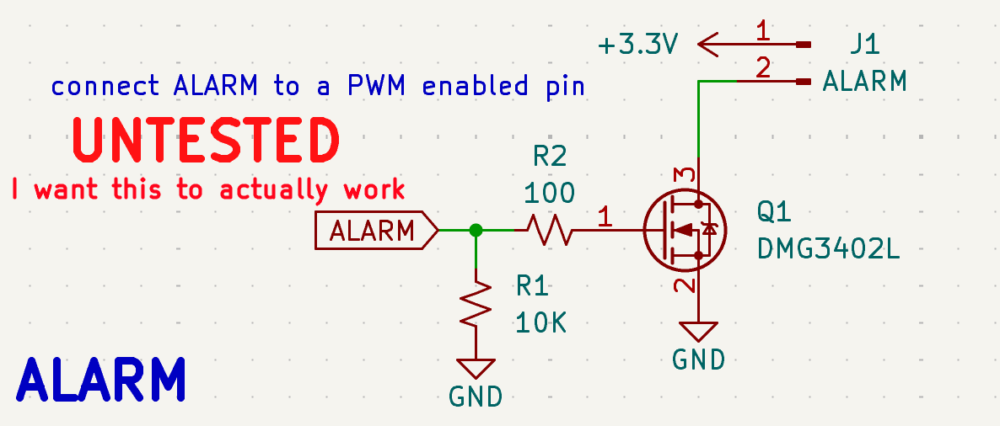

# Actuators & Alarms

## Solenoid Valve Drivers
The ECU features five independent high-side driver channels designed to actuate 24V propulsion solenoids (e.g., PeterPaul Series 20). 

*Figure 20: High-side NMOS driver with integrated current feedback.*

### Driver Specifications
* **MOSFET:** [DMG3402L](https://www.diodes.com/assets/Datasheets/DMG3402L.pdf) (N-Channel).
* **Flyback Protection:** A **45V 10A** Schottky diode (**D23**) clamps inductive kickback from the valve coils to prevent rail transients.
* **Safety Logic:** A **10k&Omega;** pulldown resistor (**R75**) ensures the valve remains **CLOSED** if the MCU pin floats during boot or reset.

### Current Feedback (Health Monitoring)

Unlike v1.0, this revision provides active feedback to confirm solenoid actuation.

* **Shunt Resistor:** A **0.1&Omega;** precision resistor (**R77**) placed in the source path translates load current into a small voltage.
* **Protection:** A **3.3V Zener** (**D24**) clamps the feedback signal to protect the MCU ADC.
* **Active Buffer:** An **MCP6001** op-amp (**U29**) buffers the signal, allowing the firmware to distinguish between a healthy firing, an open-circuit (broken wire), or a short-circuit.

---

## Emergency Alarm System
The alarm circuit is designed to provide audible status alerts at the launchpad. **Note: This circuit is currently marked as UNTESTED in the hardware rev and requires PWM validation.**

*Figure 21: Piezo/Siren driver circuit for audible telemetry.*

### Hardware Implementation
* **Driver:** **Q1** ([DMG3402L](https://www.diodes.com/assets/Datasheets/DMG3402L.pdf)) switches the low side of the **J1** alarm header.
* **Power Source:** Tied to the **+3.3V** logic rail.
* **Pin Assignment:** Connected to the **ALARM** net (**PE9**).

### Firmware Requirements (For "Actually Working")
To achieve the desired audible tones, the following software parameters must be met:
1. **PWM Frequency:** Must be tuned to the resonant frequency of the connected piezo (typically **2kHz - 4kHz**).
2. **Duty Cycle:** A **50% duty cycle** is recommended for maximum volume. 
3. **Timer Config:** Pin **PE9** must be configured in Timer Alternate Function mode to allow hardware PWM generation without CPU overhead.

---

## Integration Summary
| Channel | MCU Pin | Function | Notes |
| :--- | :--- | :--- | :--- |
| **SOL0** | PE13 | Vent Valve | NO (Normally Open) |
| **SOL1** | PE14 | Main Fuel | NC (Normally Closed) |
| **SOL2** | PE15 | Main LOX | NC (Normally Closed) |
| **ALARM** | PE9 | Piezo Siren | PWM Configurable (0-255) |

**Operational Safety:** All propulsion solenoids are hardware-interlocked to the [REDS Recovery System](../power/battery_reds.md). In a total power loss scenario, the mechanical "Normal" state of the valve is the final fail-safe.