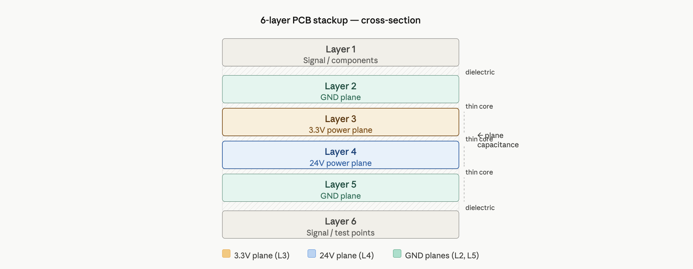
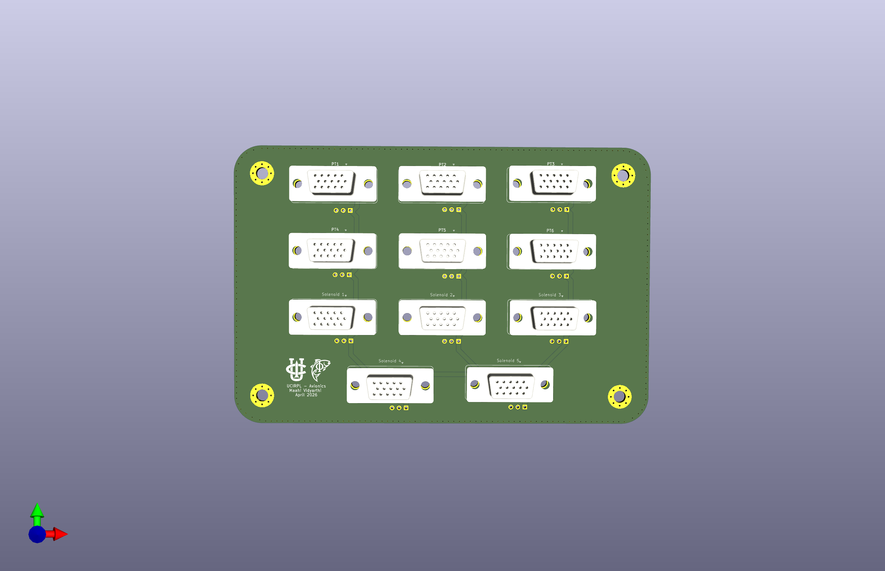
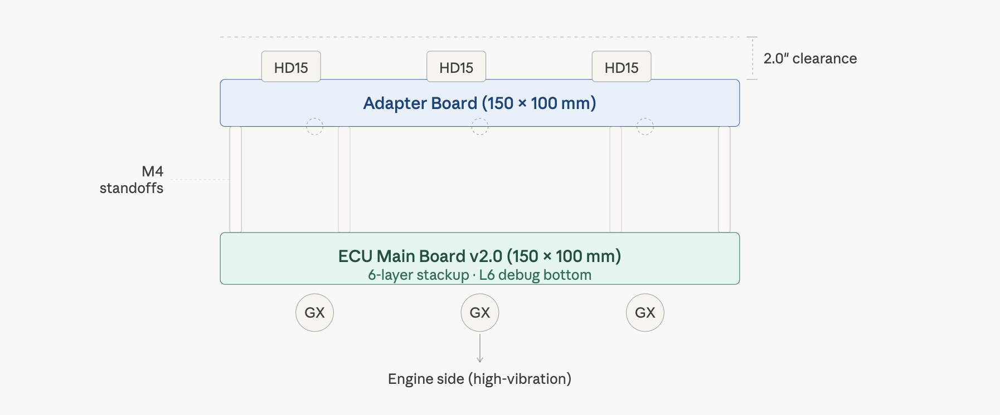

# Hardware Interface
## Electrical Design & 6-Layer Stackup

*Figure 11: 6-Layer internal routing and power distribution stackup.*

| Layer | Type | Function |
| :--- | :--- | :--- |
| **L1** | Signal/GND | Component landing and logic routing. |
| **L2** | Ground | Solid internal Faraday cage for EMI shielding. |
| **L3** | 3.3V/Signal | Stabilized logic power plane. |
| **L4** | 24V/Signal | High-current propulsion power plane. |
| **L5** | Ground | Lower shielding plane for EM isolation. |
| **L6** | Signal/GND | Bottom-side debug access and telemetry routing. |

**Design :** The proximity of L3 (3.3V) and L4 (24V) to solid GND planes (L2, L5) creates high **inter-planar capacitance**. This acts as a distributed capacitor bank, preventing logic brownouts during high-current valve actuation.

---

## Connectors & Interconnect Board
The system architecture uses a vertical stack to balance high-density I/O with mechanical reliability.

*Figure 12: 3D Render of the ECU Adapter Board.*

*Figure 13: Diagram of the ECU Adapter Board stacking over the main ECU.*

### Transition Strategy: GX to HD15 (DSUB)
* **Main ECU Interface:** Uses **GX-series** circular connectors for high-vibration engine-side connections.
* **Adapter Board:** Stacks via standoffs to convert GX footprints to **HD15 (D-Sub)** for high-density signal distribution to the avionics tray.
* **Legacy Reference:** See [Legacy GX Wiring Documentation](https://github.com/maahividyarthi/ecu-adapter-boards/blob/main/docs/connectors_v1.md) for v1.0 compatibility.

### Mechanical Constraints
| Feature | Dimension | Notes |
| :--- | :--- | :--- |
| **Board Size** | 150mm x 100mm | Matches ECU v2.0 footprint. |
| **Mounting** | 4x M3 Holes | Standardized standoff pattern for vertical stacking. |
| **Max Stack Height**| 2.0" | Combined height of ECU + Standoffs + Adapter Board. |

