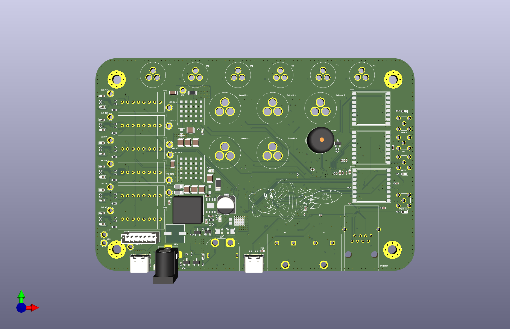

# MOCH4 Engine Control Unit (ECU)

---

## System Overview
The Rocket2 ECU is the central flight hardware for the MOCH4 vehicle. It manages power distribution, sensor data acquisition, and valve actuation for the rocket's liquid propulsion system.

*Figure 1: Top-down render of the Rocket2 ECU v2.0 PCB.*

## Stakeholders
* **AV - Hardware:** Reference for the [6-layer stackup](hardware/hardware.md) signal integrity, [JTAG debugging](hardware/hardware.md) procedures, and general design logic/justifications.
* **AV - Software:** Mapping for SPI/I2C/UART buses and [STM32 pin assignments](logic/processing.md).
* **Propulsion:** Solenoid limits, actuation behavior, and sensor scaling  
- **Launch Vehicle:** [Mounting specifications](hardware/hardware.md), structural constraints, and connector access.

## Quick Specs
| Parameter | Value | Requirement Reference |
| :--- | :--- | :--- |
| **Input Voltage** | 24V DC | 24V Battery/GSE Requirement |
| **Battery Life** | > 4 Hours | System Operations Window |
| **Logic Level** | 3.3V | STM32 Standard |
| **Mounting Pattern** | 4x M3 holes with 3.2mm clearance | Avionics |
| **Dimensions** | 150mm x 100mm | Fits MOCH4 AV Bay |

## Hardware Architecture & Layout
To ensure flight reliability, the hardware follows a strict isolation and integration strategy:

* **6-Layer Stackup:** Dedicated ground planes (L2, L5) to shield logic (L3) from 24V power noise (L4)[cite: 617, 632]. See [Electrical Design](hardware/hardware.md).
* **Integrated Connectors:** Standard [HD15 and GX-series](hardware/hardware.md) connectors are soldered directly to the board to eliminate wire-failure points.
* **Component Zoning:** The Battery Management System (BMS) and regulators are physically isolated on the left side, separated from RF antennas to minimize noise.
* **Accessibility:** All major test points and JTAG headers are accessible from the board's bottom side for post-integration debugging.

## Core Functionality
* **Propulsion:** 5 channels of high-side solenoid switching.
* **Instrumentation:** Dual-redundant [Pressure (PT)](sensors/sensors.md) and [Temperature (TC)](sensors/sensors.md) collection.
* **REDS:** [Emergency depressurization](power/battery_reds.md) capable of switching between Battery and GSE power.
* **Media:** Integrated charging for the onboard Insta360 camera.

## Debug & Failure Modes
* **Visual Feedback:** Onboard LEDs indicate 3.3V rail health and MCU heartbeat.
* **Alarm:** [Integrated siren](actuators/actuators.md) triggers on loss of GSE heartbeat or sensor failure (Note: Currently NOT IN USE).
* **Safe State:** All solenoids default to CLOSED on power loss or MCU reset to prevent unintended propellant flow.
