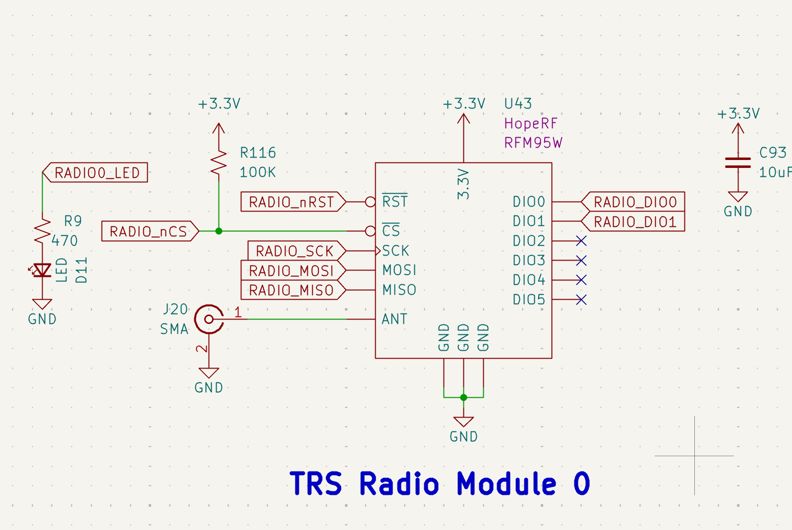
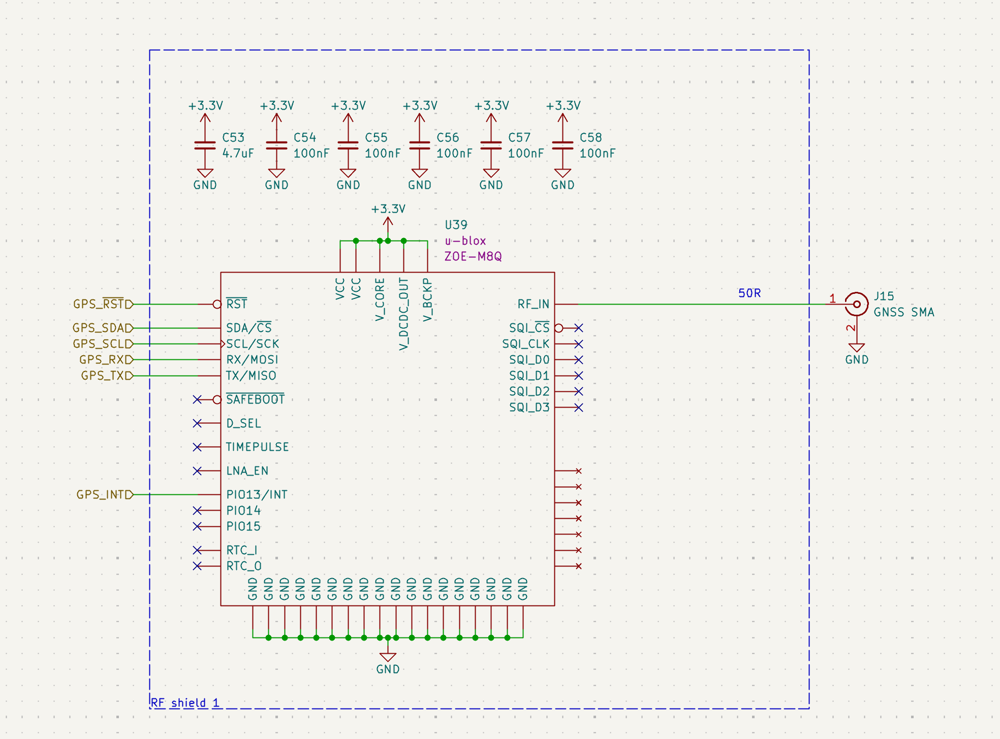
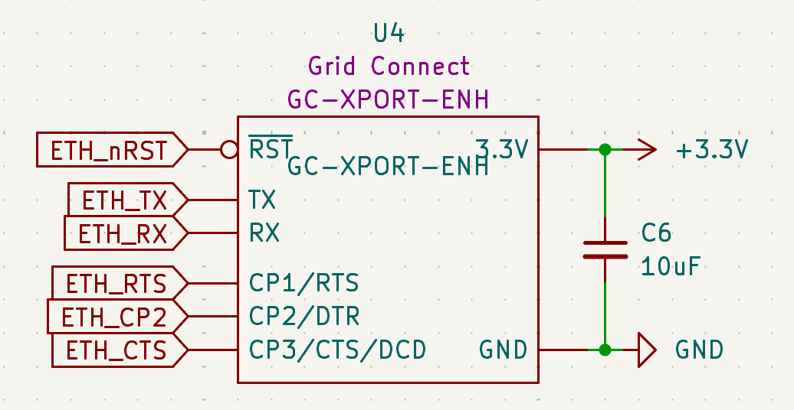

# Telemetry & Communications

## Dual LoRa Radio Modules (RFM95W)
The system utilizes two independent LoRa modules to provide long-range, low-power telemetry links at 915 MHz.

*Figure 17: Redundant TRS Radio Modules 0 and 1.*

* **Model:** [HopeRF RFM95W](https://cdn.sparkfun.com/assets/learn_tutorials/8/0/4/RFM95_96_97_98W.pdf).
* **Interface:** Connected via high-speed **SPI** with dedicated Chip Selects (**RADIO_nCS**, **RADIO1_nCS**).
* **Indicators:** Visual status is provided by **D11** and **D39** LEDs, which trigger during active packet transmission.
* **Antenna:** Standard 50&Omega; SMA connectors (**J20, J22**) are utilized for external dipole or whip antennas.
* **Design Defense:** Dual modules allow for frequency hopping or redundant data streams, ensuring telemetry persists even if one antenna path is compromised.

---

## GNSS Navigation (u-blox ZOE-M8Q)
For absolute positioning and time-synchronization, the ECU features a high-sensitivity u-blox GNSS module.

*Figure 18: ZOE-M8Q implementation with RF shielding and active filtering.*

* **Model:** [u-blox ZOE-M8Q](https://content.u-blox.com/sites/default/files/ZOE-M8_DataSheet_UBX-16008094.pdf).
* **EMI Protection:** The module is housed within a dedicated **RF Shield** to prevent internal ECU logic noise from desensitizing the GPS receiver.
* **Interface:** Connected via **UART** (**GPS_RXD/TXD**) for standard NMEA sentence parsing.
* **Antenna:** Fed through a **50&Omega;** microstrip to an SMA connector (**J15**) for external active/passive GPS antennas.

---

## Ground-Test Ethernet (Grid Connect XPort)
A hardwired Ethernet interface is provided for high-bandwidth data offloading and ground station commanding during pad operations.

*Figure 19: GC-XPORT-ENH Serial-to-Ethernet implementation.*

* **Model:** [Grid Connect GC-XPORT-ENH](https://gridconnect.box.com/shared/static/bu8k99agcgg8gspnja0ca8w7647gfghh.pdf).
* **Protocol:** Functions as a Serial-to-Ethernet bridge, allowing the STM32 to communicate over TCP/UDP via its internal USART interface.
* **Stability:** Utilizes a **10uF** decoupling capacitor (**C6**) to stabilize the 3.3V rail during high-speed data bursts.
* **Control:** The **ETH_nRST** line allows the MCU to power-cycle the module if a network hang is detected.

---

## Communication Fail-Safes
* **Independent Resets:** Both LoRa radios and the Ethernet module have discrete reset lines tied to the MCU, preventing single peripheral hang from locking the communication bus.
* **EMI Zoning:** All RF connectors (SMA) are positioned at the board edge, away from the 24V propulsion regulation zone, to maximize signal-to-noise ratio (SNR).