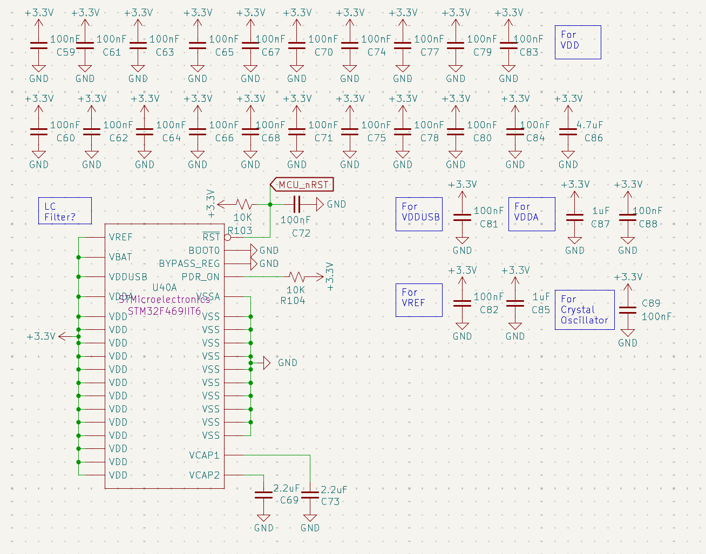
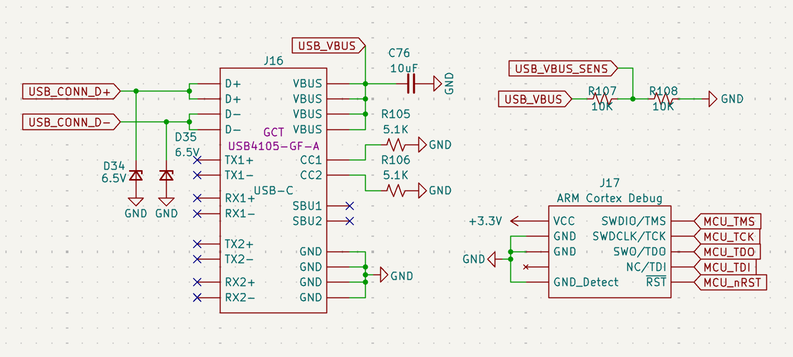
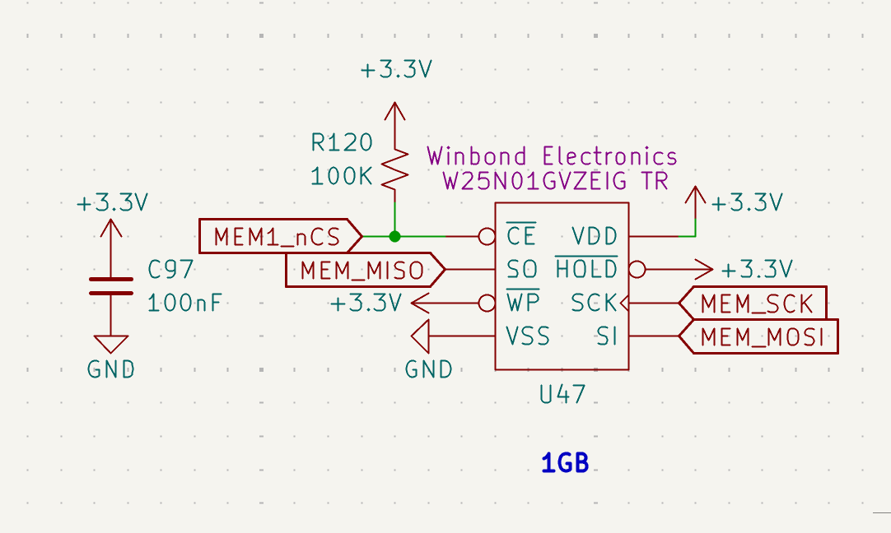

# STM32 Processing Core

## System Controller (STM32F469IIT6)
The Rocket2 ECU is powered by an ([STM32F469IIT6](https://www.st.com/resource/en/datasheet/stm32f469ii.pdf)) High-Performance MCU. This controller primarily coordinates sensor data with propulsion actuation logic.

### Power Supply & Decoupling Scheme
To ensure logic stability during high-current solenoid switching, the MCU utilizes an extensive decoupling network.

*Figure 14: STM32 Power Scheme featuring localized 100nF and bulk 4.7&mu;F capacitors.*

* **Core Stability:** Localized **100nF** capacitors are placed at every VDD/VSS pair. 
* **Analog Integrity:** Dedicated decoupling for **VDDA** and **VREF** ensures high-fidelity ADC readings for propulsion and battery sensing.
* **Internal Regulation:** **2.2&mu;F** low-ESR capacitors (**C69, C73**) are utilized on the **VCAP1/VCAP2** pins to stabilize the internal 1.2V core voltage.

---

## Debug & Programming Interfaces
The board provides two primary methods for firmware deployment and real-time telemetry debugging.

*Figure 15: USB-C interface and ARM Cortex 10-pin JTAG/SWD header.*

### SWD (Serial Wire Debug)
The **J17** header utilizes the standard **ARM Cortex 10-pin** (2x5) 1.27mm pitch layout.
* **Signals:** SWDIO, SWCLK, and SWO are routed for real-time instruction tracing.
* **Reset:** The **MCU_nRST** line is tied to a **100nF** capacitor (**C72**) and a **10k&Omega;** pull-up to prevent accidental resets from EMI.

### USB-C Interface
* **Model:** GCT USB4105-GF-A (16-pin).
* **Protection:** D34 and D35 (6.5V TVS diodes) protect the high-speed data lines from ESD during handling.
* **Sensing:** A voltage divider (**R107/R108**) on the **USB_VBUS_SENS** line allows the MCU to detect when a ground station is connected via USB.

---

## Peripheral Pin Mapping
The following table outlines the functional mapping of the MCU GPIOs. The detailed ioc file and firmware documentation will be in the rocket2-ecu-firmware repo.

| Peripheral Group | Pin | Signal Name | Function |
| :--- | :--- | :--- | :--- |
| **Actuation** | PE13-15, PG0-1 | `SOLENOID[0-4]_EN` | PWM/Logic Valve Drive |
| **Feedback** | PB0-2, PC4-5 | `SOLENOID[0-4]_FB` | Analog Current Sensing |
| **Instrumentation** | PC0-3, PA2 | `PT[1-5]` | Pressure Transducer Inputs |
| **BMS Status** | PD8-12 | `REDs_CH[0-4]` | Isolated Charging Status |
| **Telemetry** | PF0-PF9 | `RADIO[0-1]` | Dual-LoRa SPI/GPIO Bus |
| **Flight Sensors** | PG9-14 | `IMU_SPI6` | High-speed IMU Acquisition |
| **Status** | PG5 | `STATUS_LED` | Heartbeat LED (D36) |

---

## Flash Memory Architecture
The ECU features a dual-chip external storage configuration providing a total of **2GB (1Gb + 1Gb)** of non-volatile memory. This high-capacity array is dedicated to high-frequency data logging and state persistence during flight.

*Figure 16: Winbond W25N01G High-Performance Serial NAND Flash interface.*

* **Model:** [Winbond W25N01GVZEIG TR](https://www.winbond.com/resource-files/w25n01gv%20revl%20050918%20unsecured.pdf) (1G-bit / 128MB per chip).
### Hardware Configuration
* **Model:** Winbond **W25N01GVZEIG TR** (1G-bit / 128MB per chip).
* **Bus Interface:** Utilizes a high-speed **SPI** bus (`MEM_SCK`, `MEM_MISO`, `MEM_MOSI`).
* **Active-Low Select:** The chip-enable line (**MEM_nCS**) is tied to a **100k&Omega;** pull-up resistor (**R119**) to ensure the memory remains deselected during MCU reset, preventing data corruption.
* **Write Protection:** The **WP** (Write Protect) and **HOLD** pins are hardwired to **+3.3V** to allow continuous high-speed write access during flight.

### Data Logging Strategy
* **Total Capacity:** 2GB.
* **Throughput:** Optimized for the STM32's maximum SPI clock frequency to ensure that 100Hz+ sensor polling does not experience "blocking" during write cycles.
* **Decoupling:** Each IC is supported by a **100nF** decoupling capacitor (**C96**) placed immediately adjacent to the VDD pin to maintain signal integrity during high-speed switching.

---

### Fail-Safe Execution
* **Default States:** All solenoid enable pins are hardware-referenced to GND, ensuring valves remain in a safe/closed state during an MCU power loss or reset event.

