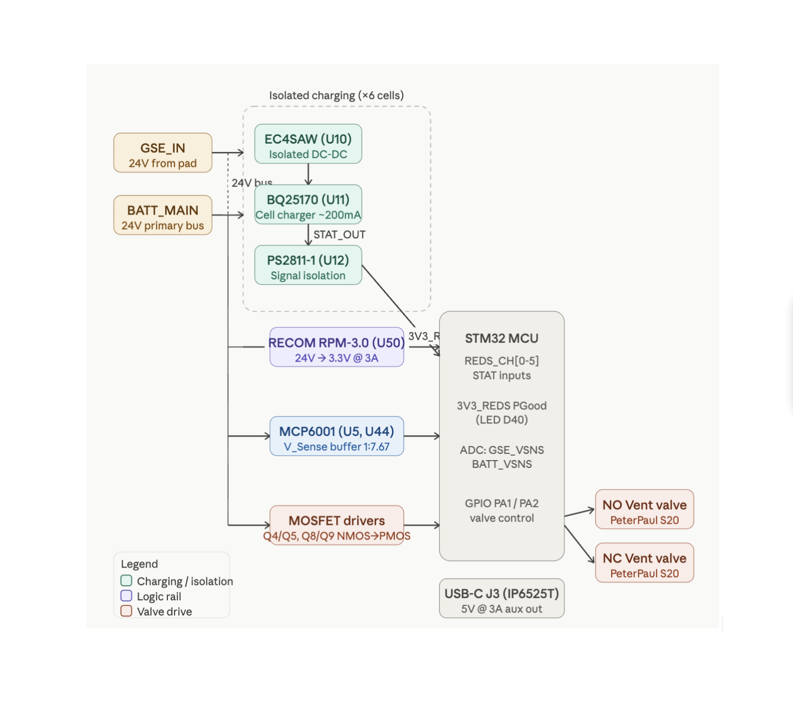
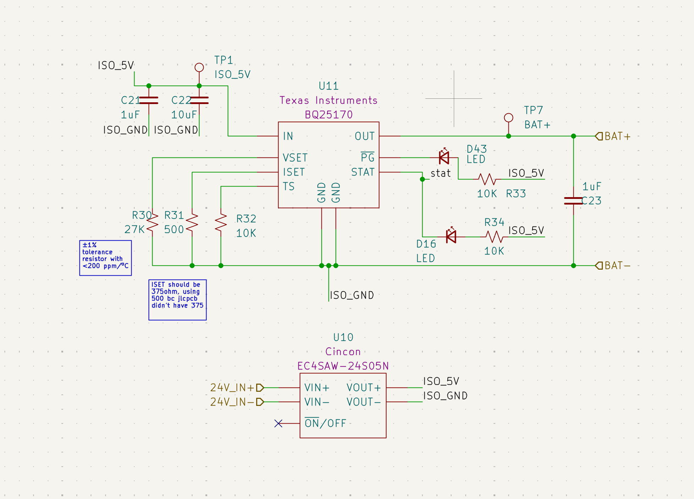
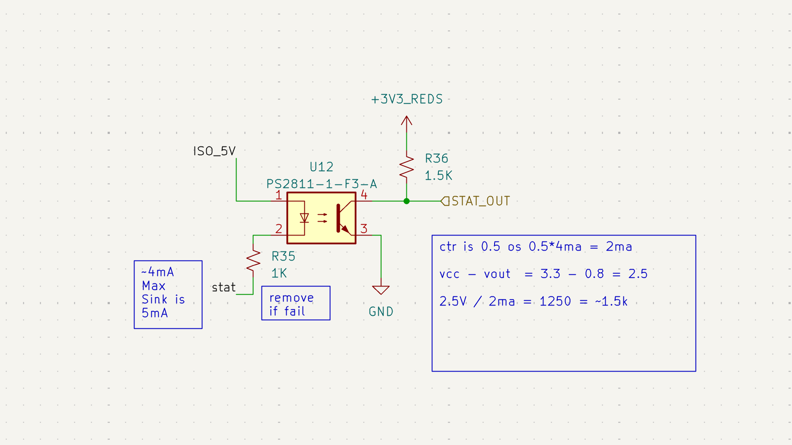
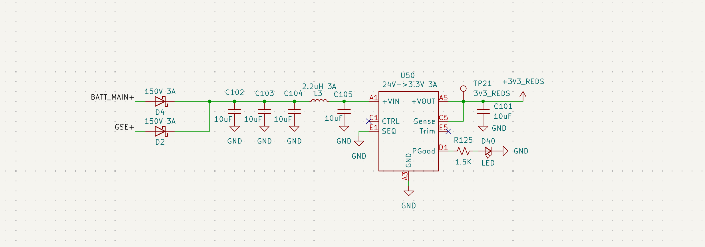
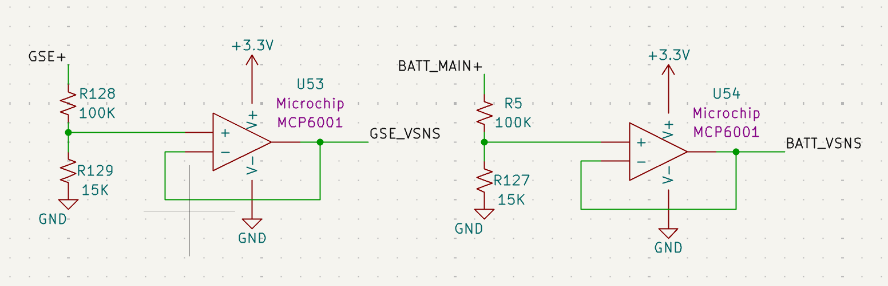
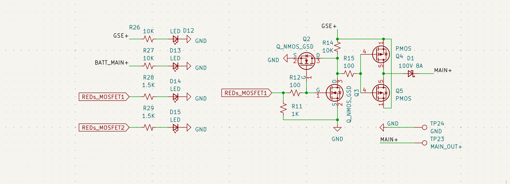
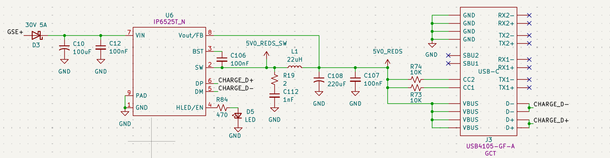

# Battery & REDS 

## Overview
The **REDS** (Recovery Event Driver System) is a safety-critical power hub. It provides an isolated environment for 6-cell battery charging, precise rail monitoring via buffered dividers, and high-side switching for propulsion vent valves. 

*Figure 4: High-level block diagram of charging isolation and recovery logic.*

## Stakeholder Relevance
* **Avionics:** Critical facet of power on electronics; ensures logic survival during high-current events.
* **Propulsion:** Drive capacity for [PeterPaul Series 20](https://www.peterpaul.com/valves/2-way-normally-opened/series-20-model-21) (NO/NC) vent valves.
* **Operations:** Pre-launch camera power and battery health monitoring.

---

## Power System Reference
| Net Name | Source | Nominal Voltage | Max Current | Notes & Hardware Specs|
| :--- | :--- | :--- | :--- | :--- |
| **GSE+** | Ground pad | 24V | 5A* | External input used at pad. |
| **BATT_MAIN+** | 6S LiPo | 22.2V - 25.2V | — | Primary vehicle battery bus. |
| **GND** | Ground | 0V | — | Reference for ECU logic and valve returns. |
| **ISO_5V** | Cincon EC4SAW | 5V | 600mA | Isolated supply per charging block; floats relative to cell GND. |
| **ISO_GND** | Cincon EC4SAW | — | — | **Isolated return**; MUST NOT be shorted to System GND. |
| **3V3_REDS** | [RECOM RPM-3.0](https://www.recom-power.com/pdf/Innoline/RPM-6.0.pdf) | 3.3V | 3A | Independent logic rail; survives primary ECU bus failure. |
| **3V3_MAIN** | ECU Buck Reg | 3.3V | — | Primary logic rail for non-recovery ECU functions. |
| **GSE_VSNS** | [MCP6001](https://ww1.microchip.com/downloads/en/DeviceDoc/MCP6001-1R-1U-2-4-1-MHz-Low-Power-Op-Amp-DS20001733L.pdf) | 0&ndash;3.3V | — | Buffered ADC signal scaling GSE+ rail (1V:7.67V). |
| **BATT_VSNS** | [MCP6001](https://ww1.microchip.com/downloads/en/DeviceDoc/MCP6001-1R-1U-2-4-1-MHz-Low-Power-Op-Amp-DS20001733L.pdf) | 0&ndash;3.3V | — | Buffered ADC signal scaling BATT_MAIN+ (1V:7.67V). |
| **5V0_REDS** | [IP6525T](https://html.alldatasheet.com/html-pdf/1131972/INJOINIC/IP6525T/458/1/IP6525T.html) | 5V | 3A | Aux rail for Insta360; sourced from GSE+ via D3. |
| **STAT_OUT[0-5]** | [PS2811-1](http://www.vishay.com/docs/81753/vo615a.pdf) | 3.3V Logic | — | Isolated charge status (Active-Low) from BQ25170. |

## Design Details

### 1. Isolated Charging Architecture
To prevent ground loops and cell-balance shorts during charging, the system utilizes 6 independent charging blocks.

*Figure 5: Isolated charging stage showing Cincon DC-DC and BQ25170.*

*Figure 6: Isolated status feedback via PS2811-1 Optocouplers.*

* **Power Isolation:** Each cell uses a **Cincon EC4SAW (U10)** to decouple the GSE power from the specific battery cell potential.
* **Signal Isolation:** `STAT_OUT` signals use [PS2811-1](http://www.vishay.com/docs/81753/vo615a.pdf) optocouplers (U12) to cross the isolation barrier to the 3.3V logic rail. 
* **Design Deviation (ISET):** Target I_SET was 375 &Omega;. Current assembly uses **500 &Omega;** (&plusmn;1%, &lt;200 ppm/&ordm;C) due to availability, resulting in a slightly lower, safer charge rate for the [BQ25170](https://www.ti.com/product/BQ25170).

### 2. 3.3V_REDS Logic Rail
The `3V3_REDS` rail is independent of the main ECU 3.3V bus to ensure recovery capability  during bus failures.

*Figure 7: U50 RECOM regulator stage with input Pi-filter.*

* **Regulator:** **U50** ([RECOM RPM-3.0](https://www.recom-power.com/pdf/Innoline/RPM-6.0.pdf)) 24V to 3.3V.
* **Input Pi-Filter:** L3 (2.2 &mu;H) and C102-104. 
* **Thermal Note:** Inductor **L3** is rated for **3A**. While the RECOM module is robust, L3 is the primary thermal bottleneck if draw exceeds 3A.

### 3. Rail Voltage Sensing (MAIN & REDS)
The ECU employs two identical dual-stage sensing circuits to monitor the health of the 24V GSE and Battery rails for both the primary ECU (MAIN) and REDS.

*Figure 8: V_Sense MAIN buffers (U53/U54) monitoring primary power rails.*

* **Circuit Identity:** The REDS sensing stage (U5/U44) is topologically identical to the MAIN stage (U53/U54) shown above.
* **Precision Divider:** A 100 k&Omega; / 15 k&Omega; network provides a 1V : 7.67V scaling ratio.
* **High-Impedance Buffering:** [MCP6001](https://ww1.microchip.com/downloads/en/DeviceDoc/MCP6001-1R-1U-2-4-1-MHz-Low-Power-Op-Amp-DS20001733L.pdf) Op-amps are configured as voltage followers. This ensures that the sensing network does not load the battery and prevents ADC input impedance from introducing measurement error.
* **Component Requirement:** Resistors must be &plusmn;1% tolerance or better to ensure measurement accuracy across the flight temperature envelope.

### 4. Valve Drive Circuitry
The board features two high-side MOSFET driver channels (Q4/Q5 and Q8/Q9) designed to drive solenoids.

*Figure 9: Typical NMOS-to-PMOS level shifting for 24V valve control (Channel 1 shown).*

* **Topology:** NMOS-to-PMOS level shifting (3.3V to 24V).
* **Flyback Protection:** Integrated 100V 8A Schottky diodes (D1, D7) clamp inductive spikes from solenoids.
* **Safety Logic:** NMOS pulldowns ensure valves remain in their "Normal" state if logic pins float.

### 5. Insta360 Camera 
A dedicated high-current 5V rail is provided for external peripherals, primarily the Insta360 flight camera.

*Figure 10: IP6525T Step-down converter for USB-C power delivery.*

* **Regulator:** **U6** ([IP6525T](https://html.alldatasheet.com/html-pdf/1131972/INJOINIC/IP6525T/458/1/IP6525T.html)) provides a stable 5V output at up to 3A.
* **Power Source:** This rail is tied to **GSE+** via a 30V 5A Schottky diode (**D3**). 
* **Ops Note:** Ops must verify the camera switches to internal battery smoothly during disconnect to ensure recording does not stop at T-0.
* **Filtering:** A 22 &mu;H inductor (**L1**) and a bulk 220 &mu;F capacitor (**C108**) minimize switching ripple to prevent video artifacts.
* **Indicator:** **LED D5** (Green) indicates the 5V Aux rail is active.

---

## Hardware&ndash;Software Interface

### Optocoupler Logic Calculation
The pull-up resistor (R36) for the `STAT_OUT` signal is **1.5 k&Omega;**.
* **CTR Calculation:** * V_{CC} - V_{OUT} = 3.3V - 0.8V = 2.5V
    * 2.5V / 2mA = 1250 &Omega; &approx; **1.5 k&Omega;**
* **Diagnostic:** If status signals fail to toggle, verify the optocoupler is driving at least 2mA.

## Errata / Revision Notes
* **Diode Corrected:** Fixed orientation of 30V 2A diode (reversed in v1.0).
* **ADC Simplification:** Deleted ADC from schematic for charge status; routed charging status to main ECU MC.