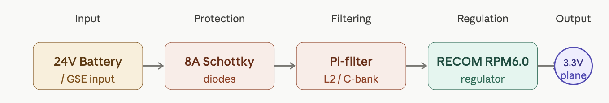
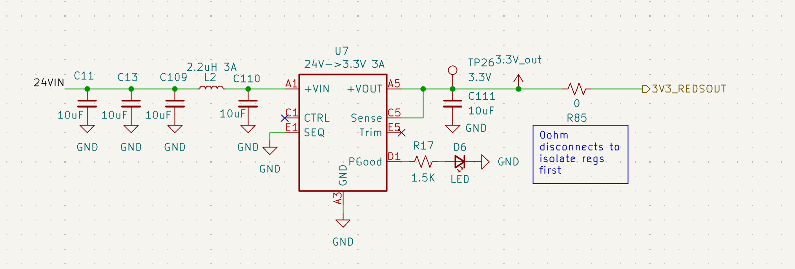

# Voltage Regulation

## Overview
The Rocket2 ECU uses a high-efficiency switching regulator to step down the 24V primary battery bus to a stable 3.3V logic rail. This rail powers the STM32, all onboard sensors, and communication modules.

*Figure 2: Voltage Regulation System Diagram*

---

## Hardware Specifications
| Parameter | Value | Note |
| :--- | :--- | :--- |
| **Regulator (U7)** | [RECOM RPM6.0-3.3](https://recom-power.com/pdf/Innoline/RPM-6.0.pdf) | LGA Power Module |
| **Input Range** | 24V Nominal | Protected against transients |
| **Output Current**| 6.0A Max | Limited by L2 (3A) |
| **Switching Freq**| 500 kHz | RECOM RPM6.0-3.3 fixed frequency PWM |

## Connections & Interfaces
* **24VIN:** Primary power input sourced from the Battery/GSE bus via a dedicated barrel jack or XT60.
* **3.3V_out:** The regulated output of the U7 RECOM module.
* **Test Point (TP26):** Main 3.3V probe point located immediately after the inductor/capacitor stage.

---
## Regulator Schematic

**Figure 3: Voltage Regulation: Schematic*

## Design Details
### Input Stage & Pi-Filter
* **24V Diodes:** Upgraded to 100V 8A Schottky diodes to prevent back-feeding and allow high-current supply for propulsion requirements.
* **Pi-Filter:** To block inductive noise, a filter is implemented using C11, C13, C109, C110 (10&micro;F each) and L2 (2.2&micro;H). 
    * *Note: L2 is 3A rated; if 6A logic draw is required, this component must be bypassed/upgraded.*

### Status & Control Logic
* **Visual Status:** LED D6 (Green) is tied to the `PGood` pin. It illuminates only when the 3.3V rail is stable (>90% of nominal).
* **Always-On Logic:** The `CTRL` pin (C1) is NC (No Connection), ensuring the regulator initializes immediately upon 24V application.

## Bringup, Failure Modes, & Debugging
* **Bringup:** Ensure R85 Isolation during testing. Confirm LED ON status prior to powering stm32.
* **Troubleshooting:** If LED D6 is Dim/Off --> remove R85, check resistance to GND.
* **Debugging:** Test Point (TP26): Main 3.3V probe point located immediately after the inductor/capacitor stage.

