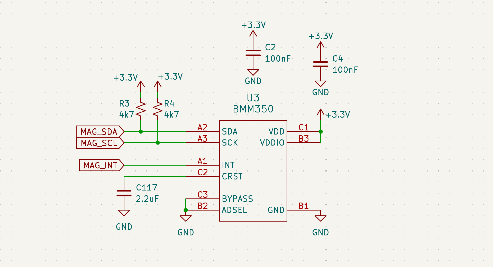
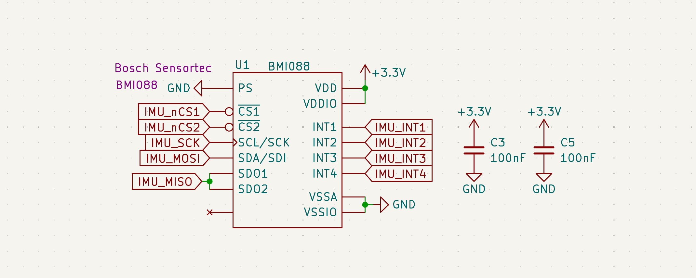
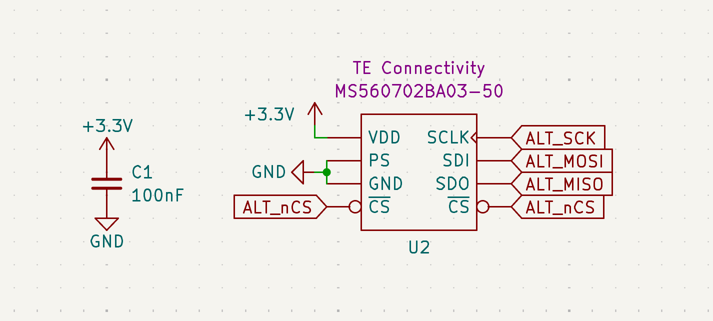
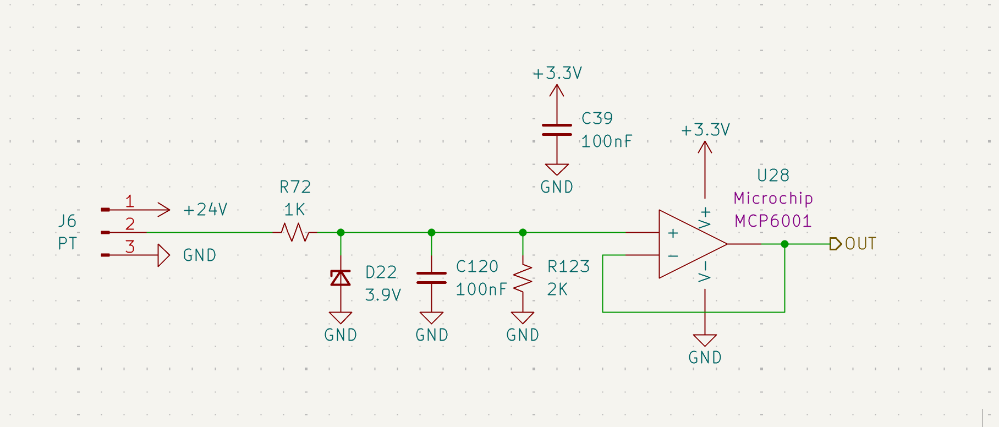
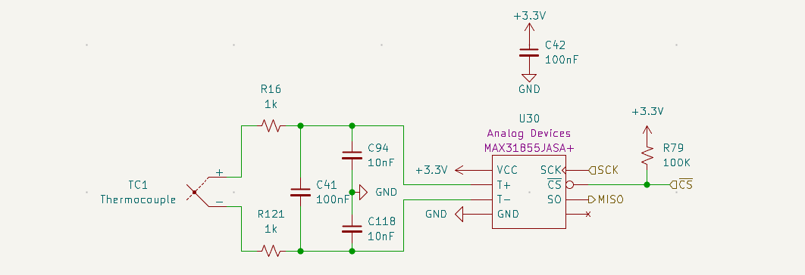

# Sensors

## Flight Sensors
The ECU utilizes a multi-sensor architecture for real-time orientation and altitude tracking. 

| Sensor | Model | Bus | Range |
| :--- | :--- | :--- | :--- |
| **IMU** | [BMI088](https://www.bosch-sensortec.com/media/boschsensortec/downloads/datasheets/bst-bmi088-ds001.pdf) | SPI | ±24g / ±2000°/s |
| **Magnetometer**| [BMM350](https://www.bosch-sensortec.com/media/boschsensortec/downloads/datasheets/bst-bmm350-ds001.pdf) | I2C |  ±2000μT |
| **Altimeter** | [MS5607](https://www.te.com/commerce/DocumentDelivery/DDEController?Action=showdoc&DocId=Data+Sheet%7FMS5607-02BA03%7FB4%7Fpdf%7FEnglish%7FENG_DS_MS5607-02BA03_B4.pdf%7FMS560702BA03-50) | SPI | 10–1200 mbar |

### Magnetometer (BMM350)
The BMM350 replaces the deprecated BMM150. It provides improved resolution (0.1μT) and a higher max sampling rate (400Hz).

*Figure 23: BMM350 I2C interface with 4.7kΩ pull-up resistors (R3, R4).*

### IMU (BMI088)
Utilizes SPI for deterministic data acquisition. Provides ±24g acceleration range and ±2000°/s rate sensing.

*Figure 24: BMI088 SPI interface with independent Accel and Gyro Chip Selects.*

### Altimeter (MS5607)
The Altimeter is connected via SPI, schematic attached below.

*Figure 25: MS5607 SPI interface with localized decoupling capacitors.*

---

## Propulsion Sensors
Propulsion sensors are subject to high EMI and vibration. Therefore, signal conditioning and filtering are critical for data integrity.

### Pressure Transducers (PT)
The PT circuit translates 0–5V analog signals from the transducer down to a 0–3.3V range suitable for the STM32 ADC.

*Figure 26: PT conditioning stage featuring voltage clamping and active buffering.*

* **Sensor Model:** [Transducers Direct TDH40](https://transducersdirect.com/products/pressure-transducers/standard-pressure-transducers/tdh40-pressure-transducer-low-price-high-accuracy-volume-discount/)
* **Voltage Divider & Clamping:** A 1kΩ (**R72**) and 2kΩ (**R123**) divider scales the signal. A 3.9V Zener (**D22**) provides overvoltage protection.
* **Active Buffer:** An **MCP6001** op-amp (**U28**) provides a low-impedance input to the ADC to prevent sampling errors.
* **Noise Filtering:** An integrated RC lpf (**R72, C120**) provides a cutoff frequency of **1591 Hz** to reject high-frequency valve and engine noise.

### Thermocouples (TC)
Uses the **MAX31855JASA+** cold-junction compensated converter.

*Figure 27: TC front-end with optimized differential and common-mode filtering.*

#### Filter Design & Justification
The TC front-end uses an optimized RC filter network to reject common-mode noise while maintaining a high signal-to-noise ratio (SNR). The design adheres to the **Cdiff > 10 &times; Ccm** rule to minimize the impact of component tolerances on noise rejection.

| Parameter | Value | Formula / Calculation |
| :--- | :--- | :--- |
| **Series Resistance (R)** | 1 k&Omega; | R16, R121 |
| **Diff. Capacitance (Cdiff)** | 100 nF | C41 |
| **Common Mode Cap (Ccm)** | 10 nF | C94, C118 |
| **Diff. Mode Cutoff (fc,dm)** | **~758 Hz** | 1 / (2&pi; &times; 2R &times; (Cdiff + Ccm/2)) |
| **Common Mode Cutoff (fc,cm)** | **~15.9 kHz** | 1 / (2&pi; &times; R &times; Ccm) |

* **Common Mode Rejection:** 10nF common-mode capacitors (**C94, C118**) reject noise that applies equally to both TC high and low voltages.
* **Sampling Sync:** The ~758Hz differential cutoff is specifically tuned to reject high-frequency engine noise while maintaining the 14Hz sampling resolution of the MAX31855.

---

### Integration & Cabling Note
As documented in the [Hardware Interface](../hardware/hardware.md), the physical sensor connection has been upgraded from direct-to-GX soldering to a standardized **Universal Adapter Board** system.

* **Sensor End:** PT/TC connects to a slot on the Universal Adapter Board.
* **Cable:** Standard VGA cables with **HD15 (D-Sub)** connectors are used for the main cable run.
* **ECU End:** Cable connects to the **ECU Adapter Board** stacked on the main ECU, completing the electrical path to the conditioned ADC pins.

